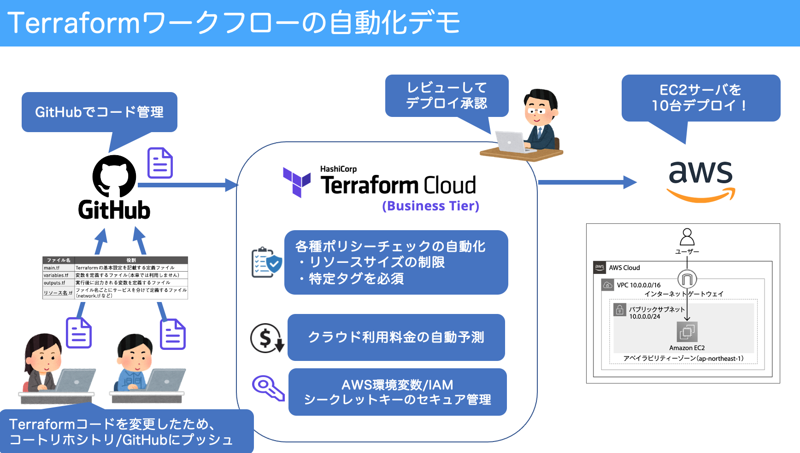

# Terraform自動化デモ

Terraform Cloudワークフローで、AWS上にEC2サーバをデプロイ実施します
- コード変更して GitHubにプッシュ
- Terraform Cloudが自動でプランが走る（コード/デプロイ内容チェック）
- クラウド利用料金コスト予測の自動チェック
- 各種ポリシーの自動チェック（リソースサイズ、特定タグの付与等）
- インフラ管理者のレビュー＆承認
- AWS上にEC2サーバをデプロイ！
